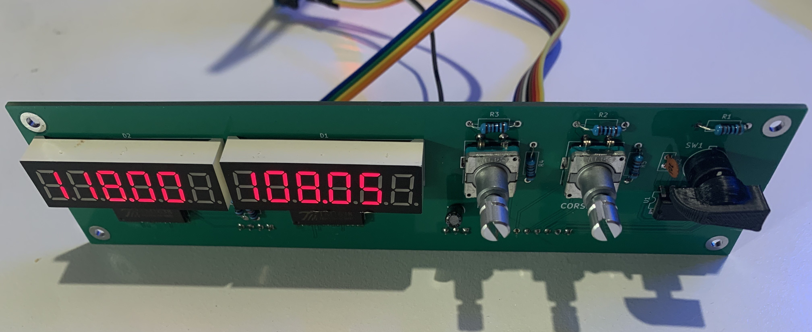

# Trimware Software

This repository contains the software for the trimware flight simulator controller products developed and stored in jaxsonpd/trimware-hw. These devices use AVR MCUs the setup for which is detailed in [setup](SETUP.md). The project uses two main programs, one running on the MCU which takes in sensor data and sends it to the host PC and the other which handles communication from the MCU to the simulator using the sim connect API. 

Current Devices:

- Radio Pannel, This allows control over various radios in flight simulator aircraft with both display and input.

Future Devices:

- Switch Panel, A selection of key switches including lights, electrical and flight systems.
- Auto Pilot Panel

## Devices

### Aviation Com, Nav and Transponder Radio

Editing of a range of frequencies availible on the aircraft. This includes:

- Com
- Nav
- ADF
- DME
- XPDR (Transponder)

Changes are made using dual quadrature encoders and data is transmitted using a custom packet format over RS232. A custom PCB is used to house the quadrature encoders, rotary switch and 12 7-segment displays this can be found in [trimware-hw](https://github.com/jaxsonpd/trimware-hw).

Here is an image of a prototype radio panel showing an active NAV 1 frequency of 118.00 MHz and a standby frequency of 108.05 MHz.



## Architecture

This project is comprised of two programs. One to run on the embedded hardware located in device/target/src and the second which handles communication with msfs2020 located in driver-rust/src. These two programs comunicate over RS232 using a custom packet format detailed in device/target/libs/custom-can-protocol or in [Custom Can Protocol](https://github.com/jaxsonpd/custom-can-protocol). The driver comunicates with the host using the simconnect api which is compatible with various leading flight simulators.

### Use

```bash
cd device/target
cmake -S . -B build/ -DCMAKE_TOOLCHAIN_FILE=cmake/atmega328p.cmak
sudo cmake --build build --target program-radio-software
```


### Testing

This project uses the [unity](https://github.com/ThrowTheSwitch/Unity) test framework to allow unity testing. This is supplemented by the [FFF](https://github.com/meekrosoft/fff) Fake Function Framework used for faking where needed. The tests are located in `./tests/` and use cmake for execution. It can be manually executed from the host directory using:

```bash
cmake -S /device/tests -B build tests
cmake --build build --parallel
ctest --test-dir build --output-on-error
```

Or using the provided bash script as follows:

```bash
source run_tests.sh
```
